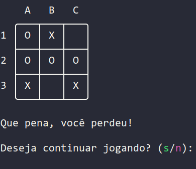

# Jogo da Velha para Terminal com algoritmo Mini-Max
## Introdução
Nesse projeto, desenvolvi um jogo da velha com
interface e implementei um algoritmo Mini-Max em
Python, utilizando somente a biblioteca Pygame.

O objetivo nesse projeto era criar um modo de
jogo que possuísse uma i.a que nunca sofresse uma
derrota e sempre conseguisse vencer quando
possível, além de um nível de dificuldade normal
onde o player quase sempre terá a chance de
vencer o jogo.
>O programa e o código fonte estão em português

## Como utilizar
```bash
$ git clone https://github.com/gbPagano/tic-tac-toe-for-terminal
$ cd ./tic-tac-toe-for-terminal
$ python main.py
```
---
Tela inicial:


Tela de seleção de dificuldade:


Tela de fim de jogo:

